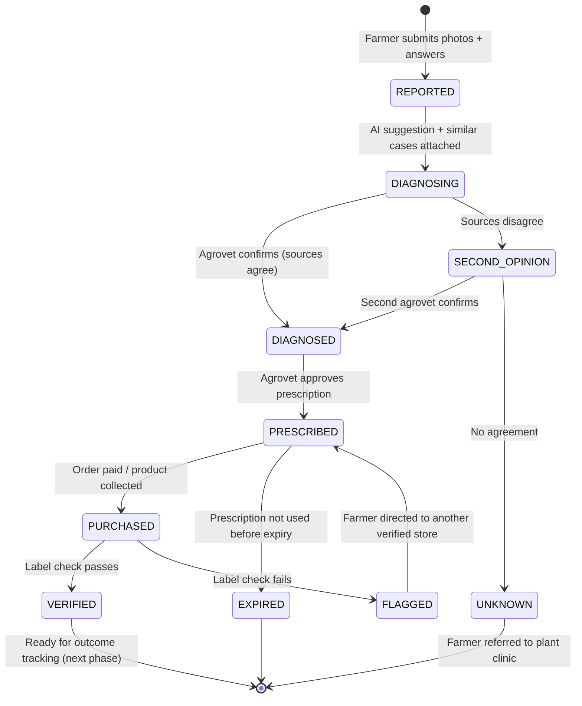
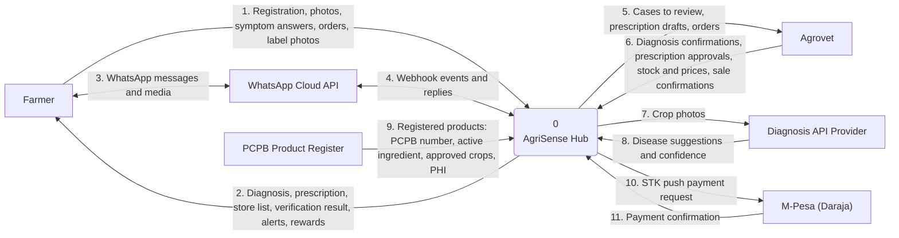
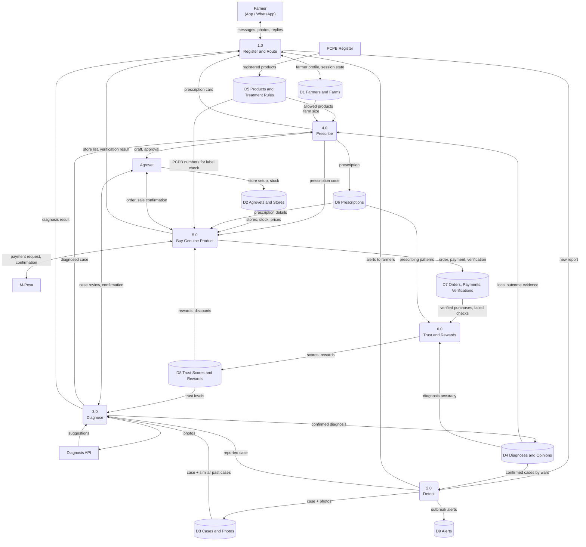
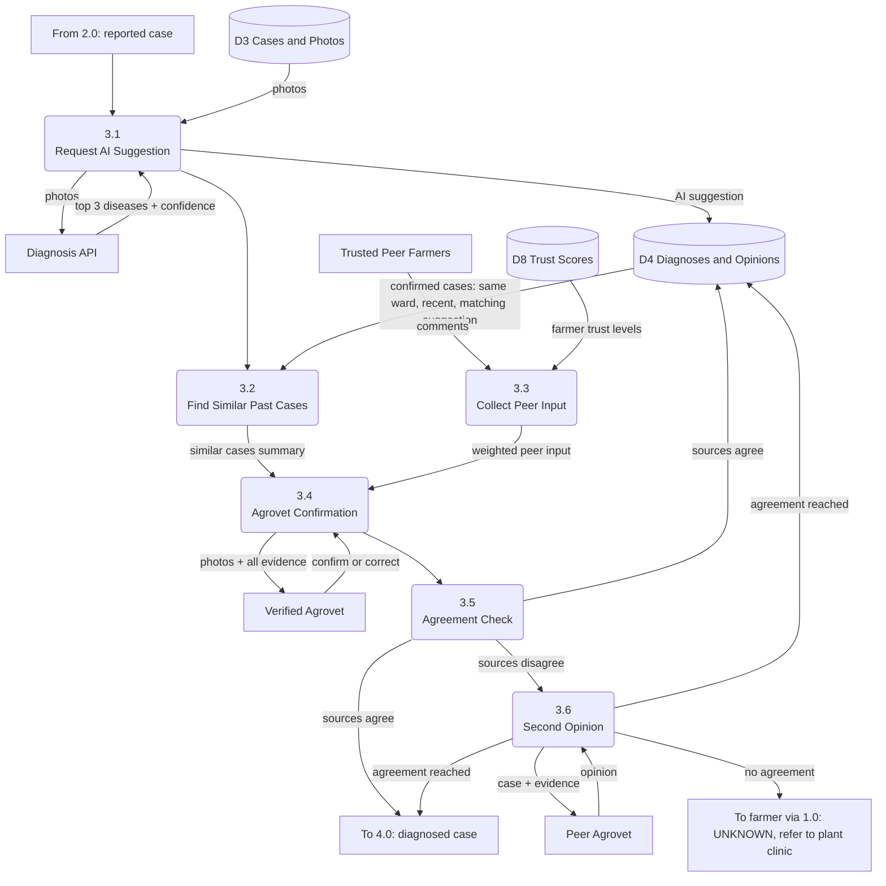
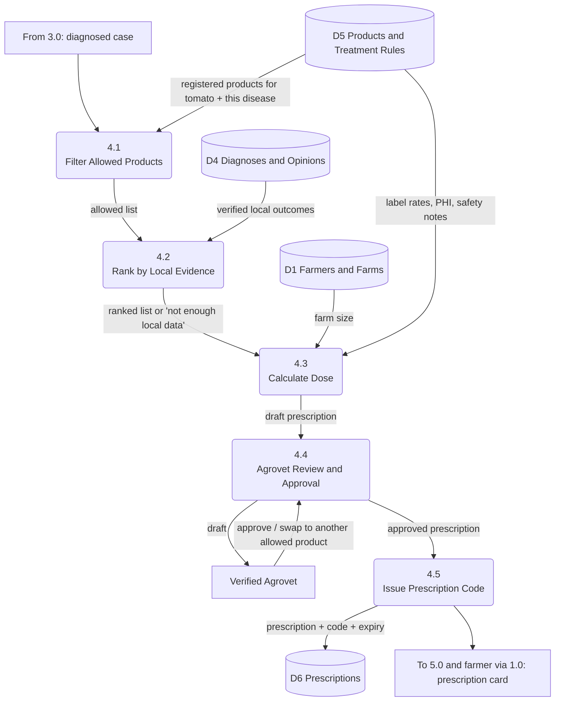
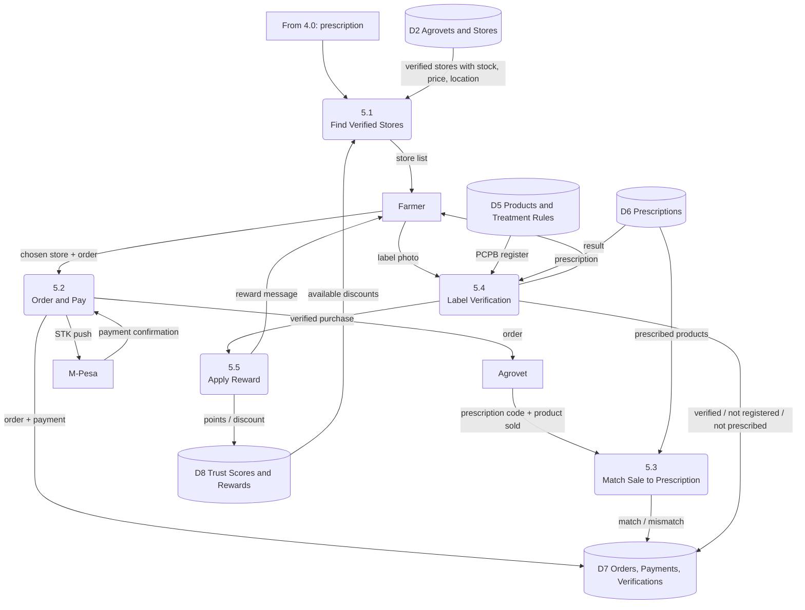

# AgriSense Hub — System Documentation

**Version:** 0.1 (Hackathon draft)
**Scope of this version:** Detect → Diagnose → Prescribe → Buy Genuine Product
**Initial focus:** Tomato farmers in Tharaka Nithi County, Kenya

---

## Table of Contents

1. [Overview](#1-overview)
2. [Problem Statement](#2-problem-statement)
3. [Design Principles](#3-design-principles)
4. [Actors and Roles](#4-actors-and-roles)
5. [Access Channels](#5-access-channels)
6. [Core Modules](#6-core-modules)
   - 6.1 [Detect](#61-module-1-detect)
   - 6.2 [Diagnose](#62-module-2-diagnose)
   - 6.3 [Prescribe](#63-module-3-prescribe)
   - 6.4 [Buy Genuine Product](#64-module-4-buy-genuine-product)
   - 6.5 [Trust and Rewards (supporting module)](#65-supporting-module-trust-and-rewards)
7. [Case Lifecycle](#7-case-lifecycle)
8. [Data Flow Diagrams](#8-data-flow-diagrams)
   - 8.1 [Level 0 — Context Diagram](#81-level-0--context-diagram)
   - 8.2 [Level 1 — System Processes](#82-level-1--system-processes)
   - 8.3 [Level 2 — Diagnose](#83-level-2--process-30-diagnose)
   - 8.4 [Level 2 — Prescribe](#84-level-2--process-40-prescribe)
   - 8.5 [Level 2 — Buy Genuine Product](#85-level-2--process-50-buy-genuine-product)
9. [Data Stores and Data Dictionary](#9-data-stores-and-data-dictionary)
10. [External Integrations](#10-external-integrations)
11. [Trust, Safety and Guardrails](#11-trust-safety-and-guardrails)
12. [Cold-Start Strategy](#12-cold-start-strategy)
13. [Technology Stack](#13-technology-stack)
14. [Future Phases](#14-future-phases)
15. [Glossary](#15-glossary)

---

## 1. Overview

AgriSense Hub is a **farmer-centred crop health network**. When a farmer's tomato crop shows signs of disease, AgriSense helps them:

1. **Detect** the problem early and report it properly
2. **Diagnose** it reliably, using AI suggestions, similar past cases from nearby farmers, and confirmation by a verified agrovet
3. **Prescribe** a safe, legally registered treatment ranked by what has worked for other farmers locally
4. **Buy a genuine product** from a verified agrovet store, with the product checked against the prescription and the PCPB register

AgriSense is built on **augmented intelligence**: existing AI services make suggestions, but **humans (farmers and agrovets) make the decisions**. The system becomes more accurate over time because every confirmed case and every verified purchase adds to a body of local, trusted evidence.

> **Tagline:** *From photo to genuine treatment — confirmed by people you trust.*

---

## 2. Problem Statement

Smallholder tomato farmers in Kenya lose large parts of their harvest to pests and diseases such as late blight, bacterial wilt and *Tuta absoluta*. The losses are made worse by three linked problems:

| Problem | Effect on the farmer |
|---|---|
| **Late or wrong diagnosis** | Farmers often buy chemicals without a proper diagnosis, so treatments fail and money is wasted |
| **Counterfeit and unregistered products** | Fake, expired and unregistered pesticides remain in circulation despite enforcement |
| **Advice tied to sales** | The agrovet is often the farmer's main source of both products and advice, which creates a conflict of interest |

**Gap in existing solutions:** AI diagnosis apps (e.g. PlantVillage Nuru, Plantix) and advisory services (e.g. iShamba, Farmer.Chat) tell farmers *what is wrong*, but none connect a confirmed diagnosis to a **registered product**, a **licensed seller**, and a **verified purchase**. The AI models also perform worse on real farm photos than on lab images, and they are not trained on local conditions.

**AgriSense's answer:** use the AI that already exists, and add what is missing: local farmer evidence, human confirmation by agrovets, and a verified path to a genuine product.

---

## 3. Design Principles

1. **The farmer is the centre of the system.** Every module reads from and writes to the farmer's record and case history.
2. **Humans decide; AI assists.** No diagnosis or prescription is final until a verified agrovet confirms it.
3. **Don't reinvent the wheel.** Use existing APIs for image diagnosis, language, payments and messaging. AgriSense's value is the local evidence and the trust layer.
4. **No extra work for public officers.** The system runs on farmers and agrovets, the people who already have a reason to take part.
5. **Registered products only.** The system never recommends or sells a product that is not on the PCPB register for that crop and disease.
6. **Local data built by use.** Every confirmed case becomes labelled local data; the dataset grows as farmers use the system.
7. **Honest uncertainty.** When evidence is weak, the system says so ("Not enough local data yet") instead of guessing.

---

## 4. Actors and Roles

| Actor | Role | Motivation |
|---|---|---|
| **Farmer** | Reports problems, confirms from experience, buys products, (later) reports outcomes | Saves their crop; gets discounts; learns from neighbours |
| **Verified Agrovet** | Confirms diagnoses, approves prescriptions, runs an in-app store, verifies sales | More customers; "Verified Agrovet" badge; online storefront |
| **Peer Agrovet** | Gives a second opinion when sources disagree | Network standing; reputation (trust score) |
| **System (AI + history)** | Suggests diagnoses, finds similar cases, enforces rules, ranks products | — |
| **System Administrator** | Onboards and verifies agrovets, maintains the product register sync | — |

**Agrovet verification requirements:**
- Valid PCPB dealer licence (uploaded at onboarding and checked)
- At least one staff member with an agricultural certificate or diploma
- Physical location confirmed (GPS)

---

## 5. Access Channels

| Channel | Users | Notes |
|---|---|---|
| **Mobile app** (Flutter) | Farmers, agrovets | Full features: case history, store, maps, agrovet dashboard |
| **WhatsApp** (Cloud API) | Farmers | Accessibility channel: no download needed; supports photos, voice notes, location and buttons |
| **USSD/SMS** *(future)* | Feature-phone farmers | Basic functions such as checking a product's registration number |

All channels feed the **same backend**. The router (Process 1.0) handles channel differences, so every other module works the same whatever channel the farmer uses.

---

## 6. Core Modules

### 6.1 Module 1: Detect

**Purpose:** catch the problem early and capture it properly.

**Triggers:**
- The farmer notices symptoms and taps **Report a problem**
- The farmer receives a nearby outbreak alert and checks their crop

**Flow:**
1. The farmer starts a report (app or WhatsApp).
2. Guided photo capture asks for **3 photos**: sick leaf close-up, whole plant, stem or fruit.
3. **Quality check:** blurry or non-tomato photos trigger a request to retake.
4. **Quick questions:** when symptoms started, share of plants affected, recent weather, anything already sprayed.
5. GPS location and farm details are attached from the farmer's profile.
6. A case is created with status `REPORTED`.

**Proactive detection (outbreak alerts):**
When the number of confirmed cases of one disease in a ward passes a threshold within a time window (e.g. 5 cases in 7 days), farmers in that ward and nearby wards receive an alert:
> *"Late blight has been confirmed by 6 farmers near Chuka this week. Check your tomatoes."*

**Outputs:** case record, photos, symptom answers, outbreak alerts.

---

### 6.2 Module 2: Diagnose

**Purpose:** reach a reliable diagnosis from three evidence sources, with a human making the final decision.

**Evidence sources:**

| Source | What it gives |
|---|---|
| **AI suggestion** (external diagnosis API) | Top 3 possible diseases with confidence scores |
| **Similar past cases** (AgriSense history) | Confirmed cases that look similar, are nearby and recent |
| **Peer farmer input** (optional) | Comments from trusted nearby farmers who have seen the problem |

**Flow:**
1. Photos are sent to the external diagnosis API → top 3 suggestions + confidence.
2. The system searches history for similar confirmed cases (by disease suggestion, location and date).
3. Trusted nearby farmers may add comments while the case waits.
4. The case goes to the farmer's chosen or nearest **verified agrovet**.
5. The agrovet sees all the evidence and **confirms** or **corrects** the diagnosis.
6. **Agreement check:**
   - AI, history and agrovet agree → `DIAGNOSED` (high confidence)
   - They disagree → `SECOND_OPINION`: the case goes to another verified agrovet
   - Still no agreement → `UNKNOWN`: the farmer is told honestly and advised to take a sample to a plant clinic

**Outputs:** confirmed disease, confidence level, who confirmed it. Every confirmed case becomes **labelled local data**.

---

### 6.3 Module 3: Prescribe

**Purpose:** provide a safe, legal treatment that has worked locally, approved by a human.

**Flow:**
1. **Rule filter (automatic, cannot be overridden):** only products that are
   - registered with PCPB,
   - approved for tomato, and
   - approved for the confirmed disease or pest.
2. **Rank by local evidence:** allowed products are ordered by verified outcomes from nearby farmers, for example:
   > *Product X — 18 of 23 verified farmers nearby reported improvement within 5 days.*
   If fewer than the minimum number of verified cases exist (default: 5), the system shows *"Not enough local data yet"* and ranks by label guidance only.
3. **Dose calculation:** quantity from farm size × label rate.
4. **Agrovet approval:** the agrovet reviews the draft, can swap to another **allowed** product (e.g. if out of stock), and approves.
5. A **prescription code** (e.g. `AGR-7F3K`) and QR code are issued and linked to the case.

**Prescription card contents:**
- Confirmed disease
- Allowed product options (with active ingredient and PCPB number)
- Quantity for the farmer's farm size
- Safety notes (PPE)
- Pre-harvest interval (days to wait before harvest)
- Prescription code and expiry date

**Conflict-of-interest control:** the system records which option each agrovet chooses. An agrovet who consistently picks the most expensive option over better-performing ones has their trust score reduced.

---

### 6.4 Module 4: Buy Genuine Product

**Purpose:** ensure the farmer gets the correct, genuine product from a licensed seller.

**Flow:**
1. The farmer sees **verified agrovet stores** nearby that stock a prescribed product, with price, distance and available discounts.
2. The farmer **orders and pays** with M-Pesa (STK push), or **reserves** and pays at the shop.
3. **At pickup**, the agrovet scans or enters the prescription code; the system checks that the product sold matches the prescription.
4. **Label check:** the farmer photographs the product label. The system reads the PCPB registration number (format `PCPB (CR) ####`) and checks:
   - **Not found** → ⚠ "Not a registered product. Do not use."
   - **Found but not prescribed** → ⚠ "Registered, but not what was prescribed for this disease."
   - **Match** → ✅ Verified
5. On a verified purchase, the farmer earns **points or a discount**.

**Store rules:**
- Only verified, licensed agrovets can open a store.
- Catalogue items must match a product in the PCPB register.
- Repeated failed label checks linked to one store create a flag and lower its trust score.

**Outputs:** order, payment record, verification result, reward.

---

### 6.5 Supporting Module: Trust and Rewards

This module runs behind the four core modules.

**Trust scores** (farmers and agrovets) increase with:
- Diagnoses later confirmed by others or by outcomes
- Verified purchases
- Consistent, photo-supported reports

and decrease with:
- Diagnoses contradicted by second opinions
- Failed label checks (agrovets)
- Prescribing patterns that favour price over evidence (agrovets)

**Rewards (offers and discounts):**
- Earned by: verified purchases, reporting cases properly, referring neighbours
- Redeemable at partner agrovets
- Also applicable to **safe practice** items: PPE, biological controls, spray services, so rewards don't encourage overuse of chemicals
- Possible funders: manufacturers (stewardship and anti-counterfeit programmes), agrovets (customer traffic), county programmes

---

## 7. Case Lifecycle

| State | Meaning |
|---|---|
| `REPORTED` | Farmer has submitted photos and answers |
| `DIAGNOSING` | AI and history evidence attached; waiting for agrovet |
| `SECOND_OPINION` | Sources disagree; with a second agrovet |
| `DIAGNOSED` | Disease confirmed by a human |
| `UNKNOWN` | No agreement; referred to a plant clinic |
| `PRESCRIBED` | Agrovet has approved a prescription |
| `EXPIRED` | Prescription not used in time |
| `PURCHASED` | Product bought from a verified store |
| `VERIFIED` | Label check passed; purchase is trusted |
| `FLAGGED` | Label check failed; investigated and farmer redirected |

---

## 8. Data Flow Diagrams

**Notation used (adapted from Gane–Sarson for Mermaid):**

| Shape | Meaning |
|---|---|
| Rectangle `[ ]` | External entity |
| Rounded rectangle `( )` | Process |
| Cylinder `[( )]` | Data store |
| Arrow with label | Data flow |

### 8.1 Level 0 — Context Diagram

The whole system as a single process and the external entities it exchanges data with.

**Level 0 data flows:**

| # | From → To | Data |
|---|---|---|
| 1 | Farmer → System (app) | Registration details, consent, crop photos, symptom answers, orders, label photos |
| 2 | System → Farmer (app) | Diagnosis, prescription card, nearby stores, verification result, outbreak alerts, rewards |
| 3 | Farmer ↔ WhatsApp | Messages, photos, voice notes, location, button replies |
| 4 | WhatsApp ↔ System | Webhook events in; replies and templates out |
| 5 | System → Agrovet | Cases to review (photos + evidence), prescription drafts, orders |
| 6 | Agrovet → System | Diagnosis confirmations/corrections, prescription approvals, stock and prices, sale confirmations |
| 7 | System → Diagnosis API | Crop photos |
| 8 | Diagnosis API → System | Top disease suggestions with confidence scores |
| 9 | PCPB Register → System | Registered products (synced periodically) |
| 10 | System → M-Pesa | STK push payment request |
| 11 | M-Pesa → System | Payment confirmation (receipt number, amount, phone) |

---

### 8.2 Level 1 — System Processes

Process 0 broken into its main sub-processes and data stores.

**Level 1 processes:**

| Process | Description | Main inputs | Main outputs | Stores |
|---|---|---|---|---|
| **1.0 Register and Route** | Single gateway for app and WhatsApp. Handles registration, consent and sessions; routes messages to the right process; delivers replies | Farmer messages, process outputs | Routed requests, replies to farmer | D1 |
| **2.0 Detect** | Guided photo capture, quality checks, symptom questions; creates cases; issues outbreak alerts | New report, confirmed cases | Case, alerts | D3, D4, D9 |
| **3.0 Diagnose** | Gets AI suggestion, finds similar cases, collects agrovet confirmation, handles second opinions | Case, AI suggestion, history | Confirmed diagnosis | D3, D4, D8 |
| **4.0 Prescribe** | Filters to registered products, ranks by local evidence, calculates dose, gets agrovet approval | Diagnosis, rules, evidence, farm size | Prescription + code | D1, D4, D5, D6 |
| **5.0 Buy Genuine Product** | Shows verified stores, handles orders and M-Pesa, checks sale against prescription, verifies label | Prescription, store data, label photo | Order, payment, verification | D2, D5, D6, D7, D8 |
| **6.0 Trust and Rewards** | Updates trust scores and issues rewards based on behaviour and verification results | Diagnoses, purchases, prescribing patterns | Scores, rewards | D4, D6, D7, D8 |

**Balancing check:** every Level 0 flow (1–11) is present at Level 1. Flows 1–4 enter and leave through 1.0; flows 5–6 connect at 3.0, 4.0 and 5.0; flows 7–8 at 3.0; flow 9 into D5; flows 10–11 at 5.0.

---

### 8.3 Level 2 — Process 3.0 Diagnose

| Sub-process | Description |
|---|---|
| 3.1 | Sends photos to the external API and stores the top 3 suggestions |
| 3.2 | Searches confirmed cases with the same suggested disease, in the same or nearby ward, in a recent window (e.g. 30 days) |
| 3.3 | Collects optional comments from nearby farmers, weighted by their trust score |
| 3.4 | Presents all evidence to the verified agrovet, who confirms or corrects |
| 3.5 | Compares AI top suggestion, similar-case majority and agrovet decision |
| 3.6 | Sends disagreements to a second verified agrovet; unresolved cases become `UNKNOWN` |

---

### 8.4 Level 2 — Process 4.0 Prescribe

| Sub-process | Description |
|---|---|
| 4.1 | Keeps only PCPB-registered products approved for tomato and the confirmed disease |
| 4.2 | Orders products by verified outcomes nearby; below the minimum count shows "not enough local data" |
| 4.3 | Calculates quantity from farm size and label rate; attaches PPE notes and pre-harvest interval |
| 4.4 | Agrovet approves or swaps to another **allowed** product (cannot add products outside the list) |
| 4.5 | Generates prescription code and QR, sets expiry, saves the prescription |

---

### 8.5 Level 2 — Process 5.0 Buy Genuine Product

| Sub-process | Description |
|---|---|
| 5.1 | Lists verified stores near the farmer that stock a prescribed product, with prices and discounts |
| 5.2 | Creates the order; handles M-Pesa STK push or reserve-and-pay-at-shop |
| 5.3 | Agrovet scans the prescription code; system checks product sold matches the prescription |
| 5.4 | Reads PCPB number from the label photo; checks registration and match with prescription |
| 5.5 | Awards points or discount for a verified purchase |

---

## 9. Data Stores and Data Dictionary

### 9.1 Data store summary

| Store | Contents |
|---|---|
| **D1 Farmers and Farms** | Farmer profile, consent, language, channel, farms (GPS, size, crops), session state |
| **D2 Agrovets and Stores** | Agrovet profile, licence, qualified staff, location, store catalogue, stock, prices |
| **D3 Cases and Photos** | Cases, photo references, symptom answers, status history |
| **D4 Diagnoses and Opinions** | AI suggestions, peer comments, agrovet confirmations, second opinions, final diagnosis |
| **D5 Products and Treatment Rules** | Synced PCPB register; disease → active ingredient rules; label rates; PHI |
| **D6 Prescriptions** | Prescriptions, allowed options, approved product(s), code, expiry |
| **D7 Orders, Payments, Verifications** | Orders, M-Pesa transactions, sale matches, label check results |
| **D8 Trust Scores and Rewards** | Trust scores (farmers, agrovets), points, discounts, redemptions |
| **D9 Alerts** | Outbreak alerts by ward, disease and date |

### 9.2 Key tables

**`farmers`**
| Field | Type | Notes |
|---|---|---|
| id | UUID | PK |
| phone | string | Unique; WhatsApp and M-Pesa identifier |
| name | string | |
| language | enum | en, sw, ki, … |
| county, ward | string | |
| consent_at | datetime | Data-use consent (Data Protection Act) |
| trust_score | decimal | Updated by 6.0 |

**`farms`**
| Field | Type | Notes |
|---|---|---|
| id | UUID | PK |
| farmer_id | UUID | FK → farmers |
| location | geography(Point) | PostGIS |
| size_acres | decimal | Used for dose calculation |
| crops | array | Initially `["tomato"]` |

**`agrovets`**
| Field | Type | Notes |
|---|---|---|
| id | UUID | PK |
| name | string | |
| pcpb_licence_no | string | Checked at onboarding |
| has_qualified_staff | boolean | Required for verification |
| location | geography(Point) | |
| status | enum | pending, verified, suspended |
| trust_score | decimal | |

**`store_items`**
| Field | Type | Notes |
|---|---|---|
| id | UUID | PK |
| agrovet_id | UUID | FK → agrovets |
| product_id | UUID | FK → products (must exist in register) |
| price_kes | decimal | |
| in_stock | boolean | |

**`products`** (synced from PCPB)
| Field | Type | Notes |
|---|---|---|
| id | UUID | PK |
| pcpb_reg_no | string | e.g. `PCPB (CR) 1234` |
| name | string | |
| active_ingredients | array | |
| approved_crops | array | |
| label_rate | string | e.g. ml per 20 L |
| phi_days | integer | Pre-harvest interval |

**`treatment_rules`**
| Field | Type | Notes |
|---|---|---|
| disease_id | UUID | FK → diseases |
| active_ingredient | string | Recommended ingredient |
| crop | string | |

**`cases`** (central table)
| Field | Type | Notes |
|---|---|---|
| id | UUID | PK |
| farmer_id | UUID | FK |
| farm_id | UUID | FK |
| status | enum | See Section 7 |
| symptom_answers | JSON | |
| channel | enum | app, whatsapp |
| created_at | datetime | |

**`case_photos`**
| Field | Type | Notes |
|---|---|---|
| case_id | UUID | FK |
| type | enum | leaf, plant, stem_fruit, label |
| storage_url | string | Object storage path |

**`diagnoses`**
| Field | Type | Notes |
|---|---|---|
| case_id | UUID | FK |
| source | enum | ai, peer_farmer, agrovet, second_agrovet |
| actor_id | UUID | Null for AI |
| disease_id | UUID | |
| confidence | decimal | AI only |
| is_final | boolean | |
| created_at | datetime | |

**`prescriptions`**
| Field | Type | Notes |
|---|---|---|
| id | UUID | PK |
| case_id | UUID | FK |
| code | string | e.g. `AGR-7F3K` |
| allowed_product_ids | array | From 4.1 |
| approved_product_id | UUID | Chosen by agrovet |
| quantity | string | |
| approved_by | UUID | FK → agrovets |
| expires_at | datetime | |

**`orders`**, **`payments`**, **`verifications`**
| Table | Key fields |
|---|---|
| orders | id, prescription_id, agrovet_id, product_id, status (reserved, paid, collected) |
| payments | order_id, mpesa_receipt, amount, phone, status |
| verifications | order_id, type (sale_match, label_check), result (verified, not_registered, not_prescribed), photo_url |

**`rewards`**, **`alerts`**
| Table | Key fields |
|---|---|
| rewards | farmer_id, reason, points, discount_code, redeemed_at |
| alerts | disease_id, ward, case_count, window_start, window_end, sent_at |

---

## 10. External Integrations

AgriSense reuses existing services instead of rebuilding them.

| Need | Service | Notes |
|---|---|---|
| Image disease suggestion | Existing crop-diagnosis API (candidates: Kindwise crop.health; Plantix B2B) | Evaluate tomato coverage, accuracy on Kenyan field photos, pricing |
| WhatsApp channel | WhatsApp Business Cloud API (Meta) | Webhooks; template messages for alerts; 24-hour reply window |
| Payments | M-Pesa Daraja (STK push) | Order payments |
| Product register | PCPB online register | No known public API; periodic import/sync into D5 |
| Label reading | OCR service (e.g. Google Cloud Vision, or Tesseract) | Extracts PCPB registration number |
| Language | LLM / translation API | Swahili and local-language messages |
| Maps | PostGIS + map tiles | Nearby stores, outbreak maps |

---

## 11. Trust, Safety and Guardrails

| Guardrail | Purpose |
|---|---|
| Every diagnosis and prescription must be confirmed by a verified agrovet | Prevents AI-only mistakes |
| Second agrovet opinion when sources disagree | Limits one agrovet's error or bias |
| `UNKNOWN` is an allowed outcome | Avoids confident wrong answers |
| Registered-products-only rule (cannot be overridden) | Prevents unsafe or illegal recommendations |
| Community evidence only **ranks** allowed products; it never adds products or changes doses | Prevents spread of harmful practices |
| Minimum evidence count before showing local results (default 5) | Prevents misleading small samples |
| Verified purchase required before a farmer's reports count as evidence | Prevents fake reviews |
| Trust scores for farmers and agrovets | Reduces repeat misinformation |
| Monitoring of agrovet prescribing patterns | Addresses conflict of interest |
| Area-level results only; no individual farmer data shown | Privacy |
| Explicit consent at registration | Compliance with Kenya's Data Protection Act, 2019 |

---

## 12. Cold-Start Strategy

Local data cannot be collected in a short period, so the system starts with AI + agrovet confirmation and builds local evidence over time.

| Phase | Activity | Main source of diagnosis |
|---|---|---|
| **Pilot setup** | 1–2 wards in Tharaka Nithi; tomato only; recruit 5–10 verified agrovets | — |
| **Season 1** | Onboard farmers through farmer groups and cooperatives; collect confirmed cases | AI suggestion + agrovet confirmation |
| **Season 2** | Similar-case matching and local evidence start appearing for common diseases | AI + history + agrovet |
| **Season 3+** | Expand to more wards and crops; local evidence becomes the main ranking signal | History + agrovet, AI as support |

Each confirmed case is also a labelled local image, building a Kenya-specific tomato dataset as a by-product.

---

## 13. Technology Stack

| Layer | Technology |
|---|---|
| Mobile app | Flutter |
| Backend API | Django REST Framework |
| Background jobs | Celery + Redis (webhook processing, API calls, alerts) |
| Database | PostgreSQL + PostGIS |
| File storage | Object storage (photos) |
| Messaging | WhatsApp Business Cloud API |
| Payments | M-Pesa Daraja |
| Hosting | Render / VPS |

---

## 14. Future Phases

| Phase | Feature |
|---|---|
| **Phase 2: Apply and Follow Up** | Spray guidance, PPE reminders, weather-based spray timing, pre-harvest countdown; day 2/5/7 outcome reports with photos |
| **Phase 3: Community Evidence** | Outcome reports from verified purchases feed the ranking in Prescribe |
| **Phase 4: Insights** | Outbreak maps, product-failure signals (possible resistance or counterfeits), anonymised reports for counties and PCPB |
| **Phase 5: Finance and Markets** | Input credit at checkout; links to buyers and market prices |
| **Phase 6: USSD/SMS** | Basic access for feature-phone users |

---

## 15. Glossary

| Term | Meaning |
|---|---|
| **Agrovet** | Licensed agricultural input shop |
| **Augmented intelligence** | AI that supports human decisions rather than replacing them |
| **Case** | One crop problem reported by a farmer, tracked through all stages |
| **PCPB** | Pest Control Products Board, Kenya's pesticide regulator |
| **PHI** | Pre-harvest interval: days to wait between spraying and harvesting |
| **Prescription code** | Unique code linking a case's approved treatment to a purchase |
| **STK push** | M-Pesa prompt sent to the farmer's phone to approve payment |
| **Trust score** | Reputation value for farmers and agrovets, based on verified behaviour |
| **Verified agrovet** | Licensed agrovet with qualified staff, approved to confirm diagnoses and run a store |
